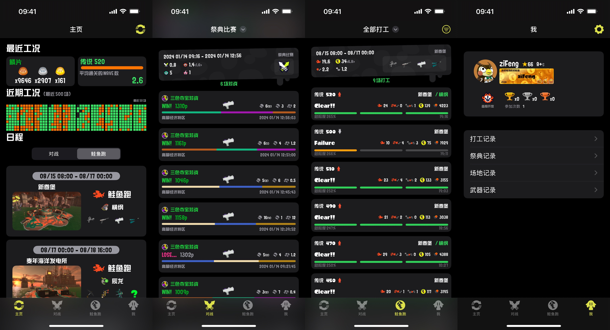

# imink - 喷射战士3 数据助手

<div align="center">


**为《喷射战士3》玩家打造的iOS数据助手应用**

[](https://developer.apple.com/ios/)
[](https://swift.org/)
[](https://developer.apple.com/xcode/swiftui/)
[](LICENSE)

</div>

## 📱 应用简介

imink 是一款专为《喷射战士3》(Splatoon 3) 玩家设计的iOS应用，通过任天堂账号授权，帮助玩家查看和管理游戏数据，包括对战记录、鲑鱼跑记录、装备信息等。

## ✨ 主要功能

### 🏠 主页

- **实时对战状态** - 显示当前对战模式和地图信息
- **鲑鱼跑状态** - 显示当前鲑鱼跑模式和地图信息
- **日程安排** - 查看未来对战和鲑鱼跑的时间表
- **数据统计** - 个人游戏数据概览

### ⚔️ 对战记录

- **详细对战记录** - 查看每场对战的详细信息
- **战绩分析** - 胜率、KD比、武器使用统计
- **地图记录** - 各地图的胜率统计
- **武器记录** - 各武器的使用情况和胜率

### 🐟 鲑鱼跑记录

- **打工记录** - 查看鲑鱼跑打工历史
- **波次详情** - 每波次的详细信息和表现
- **巨大鲑鱼统计** - 击败的巨大鲑鱼数量统计
- **评价等级** - 打工评价等级历史

### 👤 个人中心

- **账号管理** - 任天堂账号登录和登出
- **数据备份** - 导入/导出用户数据
- **设置选项** - 应用偏好设置

## 🎨 界面特色

- **原生SwiftUI设计** - 现代化的iOS界面设计
- **喷射战士主题** - 采用游戏原版配色和字体
- **多语言支持** - 支持中文、英文、日文等多种语言
- **深色模式** - 支持系统深色模式
- **触觉反馈** - 提供丰富的触觉反馈体验

## 📸 应用截图

### 主页界面



## 🚀 安装要求

- **iOS版本**: iOS 18.0 或更高版本
- **设备**: iPhone 和 iPad
- **网络**: 需要网络连接以同步游戏数据
- **账号**: 需要任天堂账号进行授权

## 📦 安装方法

### 从源码编译

1. **克隆项目**

   ```bash
   git clone https://github.com/your-username/imink.git
   cd imink
   ```
2. **打开项目**

   ```bash
   open imink.xcodeproj
   ```
3. **配置开发者账号**

   - 在Xcode中打开项目
   - 选择项目 → Signing & Capabilities
   - 配置你的Apple Developer账号
4. **编译运行**

   - 选择目标设备或模拟器
   - 点击运行按钮或按 `Cmd+R`

### 依赖库

项目使用以下主要依赖：

- **GRDB** - SQLite数据库操作
- **Zip** - 数据压缩和解压
- **AlertKit** - 用户界面提示

## 🔐 授权说明

imink 使用任天堂官方API获取游戏数据，需要：

1. **任天堂账号登录** - 使用你的任天堂账号进行授权
2. **数据同步** - 应用会定期同步你的游戏数据
3. **本地存储** - 数据存储在本地设备上，保护隐私

## 🌐 多语言支持

imink 支持以下语言：

- 简体中文 (zh-Hans)
- 繁体中文 (zh-Hant)
- 英语 (en)
- 日语 (ja)
- 韩语 (ko)
- 德语 (de)
- 法语 (fr)
- 西班牙语 (es)
- 意大利语 (it)
- 荷兰语 (nl)
- 俄语 (ru)

## 🛠️ 技术架构

- **前端框架**: SwiftUI
- **网络层**: 自定义网络框架 (InkMoya)
- **数据存储**: SQLite (GRDB)
- **状态管理**: Combine + @StateObject
- **本地化**: 原生iOS本地化系统

## 📁 项目结构

```
imink/
├── imink/                    # 主应用代码
│   ├── Views/               # 视图层
│   │   ├── Home/           # 主页相关视图
│   │   ├── Battle/         # 对战相关视图
│   │   ├── Coop/           # 鲑鱼跑相关视图
│   │   └── Me/             # 个人中心视图
│   ├── ViewModels/         # 视图模型
│   └── Assets.xcassets/    # 应用资源
├── Shared/                  # 共享代码
│   ├── API/               # API接口
│   ├── Models/            # 数据模型
│   ├── SplatNet3/         # SplatNet3相关
│   └── Utils/             # 工具类
└── script/                 # 脚本文件
```

## 🤝 贡献指南

欢迎贡献代码！请遵循以下步骤：

1. Fork 本项目
2. 创建你的特性分支 (`git checkout -b feature/AmazingFeature`)
3. 提交你的更改 (`git commit -m 'Add some AmazingFeature'`)
4. 推送到分支 (`git push origin feature/AmazingFeature`)
5. 打开一个 Pull Request

## 📄 许可证

本项目采用 MIT 许可证 - 查看 [LICENSE](LICENSE) 文件了解详情。

## 🙏 致谢

- 感谢所有贡献者的支持
- 感谢喷射战士3社区的热情支持
- 致谢所有被使用到或者参考过的开源代码，暂不一一列出

## 📞 联系我们

- **项目主页**: [GitHub Repository](https://github.com/your-username/imink)
- **问题反馈**: [Issues](https://github.com/your-username/imink/issues)
- **功能建议**: [Discussions](https://github.com/your-username/imink/discussions)

---

<div align="center">

**享受喷射战士3的乐趣！** 🎮

*Made with ❤️ for Splatoon 3 players*

</div>
